# Hi there, I'm [Your Actual Name]! 👋

### 🛡️ Cybersecurity Engineer | Kernel Researcher | Red Teamer
I am a security engineer specializing in **Low-Level Security**, **Kernel Development**, and **Adversary Simulation**. My passion lies in understanding systems at the deepest level—from kernel syscalls to industrial protocols—to build robust defense mechanisms and simulate advanced threats.

- 🔭 I’m currently working on a **Linux Kernel Security Monitor using eBPF**
- 🛡️ I’m researching **ICS/SCADA Security** and **Windows Internals**
- 🐧 Daily Driver: **Arch Linux**
- 📫 Reach me at: **[Your Email]**

---

### ⚡ Tech Stack & Arsenal

| Domain | Technologies |
| :--- | :--- |
| **Low-Level & Systems** |     |
| **Scripting & Automation** |    |
| **Security Tools** |    |
| **Operating Systems** |   |

---

### 📂 Featured Engineering Projects

#### 1. 🛡️ eBPF Kernel Security Monitor
> *A lightweight, high-performance observability tool designed to detect anomalous behavior at the Linux kernel level using eBPF hooks.*

<b>🔎 View Architecture Diagram</b>

 

#### 2. 🛡️ WinSentinel (Windows HIPS)
> *A Host Intrusion Prevention System engineered for Windows, utilizing a custom Kernel Mode Driver (KMDF) to monitor process creation and registry ops.*

<b>🔎 View Architecture Diagram</b>

 

#### 3. 💀 ShadowC2 (Adversary Simulation)
> *A modular C2 framework prioritizing OPSEC with a Golang Team Server and stealthy, malleable C implants.*

```mermaid
graph LR
    Operator["🔴 Operator"]
    TS["Team Server (Go)"]
    Listener["Listener"]
    Implant["💀 Implant"]
    Operator --> TS
    TS --> Listener
    Implant -- "Encrypted Beacon" --> Listener
```

<b>🔎 View Architecture Diagram</b>

 

#### 4. 🚗 AutoGuard (Automotive IDS)
> *An Intrusion Detection System for CAN Bus networks that uses statistical analysis to detect replay attacks and fuzzing.*

---

### 📊 GitHub Stats

  
  

---

### 🔗 Connect

